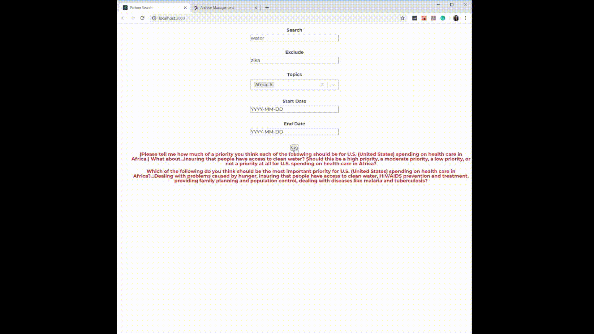

# Partner Search
### A dynamic and embeddable search module made for the Roper Center and their partner organizations. 
*The code for this project is not open source, but I was permitted to share these images *

  The Roper Center for Public Opinion Research (https://ropercenter.cornell.edu/) is an organization hosted at Cornell University that archives and analyzes public opinion poll data. At Roper, partners are organizations which send the data from public opinion polls that they conduct or sponsor to the Roper Center. 

  During my spring 2019 semester co-op with the Roper Center, I built a new search module which will be used by the Roper Center's partner organizations. This search module allows users of the partner organization to access public opinion poll data which that partner has sent to the Roper Center for archiving and analysis. As an example, consider the Washington Post as a partner. Newspaper subscribers could find this search module on their web page (if the Post opts in to this service) and use it to search through public opinion polls that the Post has sponsored or conducted.

  What I built is very bare-bones, because the module is meant to be customized to fit the theme of the partner's page. This module will be embedded in the websites of organizations that already send Roper data, and who then choose to partner with Roper in this way. The code for the search module would be sent to each partner organization ready to be inserted into the code for their website, and the only change they'd have to make is to import a styles library and add their unique API key.

## The Search Module
  Once a partner has been set up via the Partner Management page (detailed in a [section below](#partner-management)), their embedded search module will begin to work. The API key for each partner/module includes the ID of the partner making the request, and that information is sent along with the API request as an additional parameter. Using this information, the search results are filtered to only return survey data specific to the partner organization (surveys that they have either sponsored or conducted). Thus, this is a way for the partner's users to search through that specific partner's data. 

  The results of the search are survey questions. The examples shown below are filtered as though the partner is The Washington Post. As a reminder, what you will see is very bare-bones, because the module is meant to be customized to fit the theme of the partner's page.

At the most basic level, a user can input a keyword to search by:

In addition, to filter results, a user can input a keyword to be excluded -- one that should not appear in search results:

An additional filter of topics ensures the results are only those that have been marked as the selected topic(s):

The search results can be toggled open or closed to view the responses and the distribution of each response:

The expiration date for the partner's use of this service is encrypted in the API Token. If an API Token expires (or is invalid in any way), the search module is greyed out and inaccessible and the following message appears:

## Partner Management
Within the Roper Center's internal system, I built the Partner Management page, modeled after an existing Member Management page. Administrators are able to add a partner to the records with attributes such as partnership expiration date, referrer domain, and others. 

In the below example, a test user is added:

In the partner management page, an existing partner can be edited:

The referrer domain is the website the API request is coming from. RegEx logic was added to ensure that website suffixes are included in the referrer domains input, to ensure that unauthorized websites are not able to access this data (e.g. pewresearch.com instead of the authorized pewresearch.org): 

For active users, a unique API key is generated for them via the Partner Management page. Once an API token is generated, the "Generate API Token" button changes to a "Copy API Token" button. This allows the administrator to copy the API Token to their clipboard, from which they can then send it to the relevant partner. 

If the partner is not active (never became active, or the expiry date has passed), the "Generate API Token" button will not work and an alert message will show. 

Every 24 hours, a script runs to check if there are any expired partners. Expired partners are deactivated after a 2 week grace period. 
